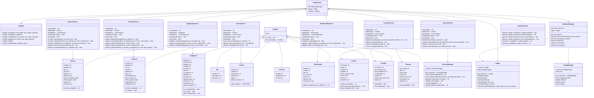

```mermaid

classDiagram
%% Clases de Utilidades
class Logger {
-\_instance: Logger
-logger: logging.Logger
+get_instance(): Logger
+debug(message)
+info(message)
+warning(message)
+error(message, exc_info)
+critical(message, exc_info)
+log_db_operation(operation, entity, entity_id, user_id, details)
}

    class Validator {
        +validate_string(value, min_length, max_length, required)
        +validate_email(email, required)
        +validate_number(value, min_value, max_value, required)
        +validate_date(date, min_date, max_date, required)
        +validate_dni(dni)
        +validate_model(model, validation_rules)
    }

    class SecurityManager {
        -_instance: SecurityManager
        +get_instance(): SecurityManager
        +hash_password(password): str
        +verify_password(stored_password, provided_password): bool
        +generate_token(user_id, expiry): str
        +validate_token(token): dict
        +encrypt_data(data): str
        +decrypt_data(encrypted_data): str
    }

    class ConfigManager {
        -_instance: ConfigManager
        -config: dict
        +get_instance(): ConfigManager
        +load_config(config_file)
        +get(key, default)
        +set(key, value)
        +save_config()
    }

    %% Clase de Acceso a Datos
    class DatabaseManager {
        -connection_string: str
        -logger: Logger
        +get_connection()
        +execute_stored_procedure(sp_name, params)
        +execute_query(query, params)
        +begin_transaction()
        +commit_transaction()
        +rollback_transaction()
    }

    %% Clases Base
    class Entidad {
        +id: int
        +to_dict(): dict
        +from_dict(datos): Entidad
    }

    class BaseService {
        +db: DatabaseManager
        +logger: Logger
        +validator: Validator
    }

    %% Modelos de Entidades
    class Alumno {
        +nombre: str
        +apellido: str
        +dni: str
        +email: str
        +telefono: str
        +direccion: str
        +fecha_nacimiento: date
        +fecha_ingreso: date
        +estado: str
        +carreras: List
        +nombre_completo(): str
    }

    class Profesor {
        +nombre: str
        +apellido: str
        +dni: str
        +email: str
        +telefono: str
        +titulo: str
        +especialidad: str
        +tipo_contrato: str
        +fecha_ingreso: date
        +departamento: str
        +asignaturas: List
        +nombre_completo(): str
        +es_titular(): bool
    }

    class Asignatura {
        +nombre: str
        +hsemanal: int
        +htotales: int
        +creditos: int
        +id_area: int
        +area: str
        +id_regimen: int
        +regimen: str
        +id_depto: int
        +departamento: str
        +profesores: List
        +correlativas: List
        +planes_estudio: List
        +es_cuatrimestral(): bool
        +es_anual(): bool
        +tiene_correlativas(): bool
    }

    class Carrera {
        +nombre: str
        +codigo: str
        +descripcion: str
        +duracion: int
        +titulo: str
        +planes_estudio: List
        +plan_vigente(): PlanEstudio
    }

    class PlanEstudio {
        +nombre: str
        +codigo: str
        +año: int
        +id_carrera: int
        +carrera: str
        +vigente: bool
        +asignaturas: List
        +obtener_asignaturas_por_año(año): List
    }

    class Usuario {
        +username: str
        +email: str
        +nombre: str
        +apellido: str
        +fecha_creacion: date
        +activo: bool
        +roles: List
        +permisos: List
        +nombre_completo(): str
        +tiene_permiso(codigo_permiso): bool
        +tiene_rol(nombre_rol): bool
    }

    class Rol {
        +nombre: str
        +descripcion: str
        +permisos: List
    }

    class Permiso {
        +codigo: str
        +descripcion: str
        +modulo: str
    }

    class Cursada {
        +id_alumno: int
        +id_asignatura: int
        +año_academico: int
        +cuatrimestre: int
        +estado: str
        +fecha_inscripcion: date
        +notas: List
        +promedio(): float
        +esta_aprobada(): bool
    }

    class Examen {
        +id_cursada: int
        +tipo: str
        +fecha: date
        +nota: float
        +observaciones: str
        +id_profesor: int
        +profesor: str
        +esta_aprobado(): bool
    }

    %% Servicios
    class AlumnoService {
        +crear(datos): int
        +obtener(id): Alumno
        +listar(filtros): List~Alumno~
        +modificar(id, datos): bool
        +eliminar(id): bool
        +inscribir_carrera(alumno_id, carrera_id): bool
        +inscribir_asignatura(alumno_id, asignatura_id, año, cuatrimestre): bool
        +registrar_nota(alumno_id, asignatura_id, nota, tipo_examen): bool
        +obtener_historial_academico(alumno_id): List
        +verificar_correlativas(alumno_id, asignatura_id): bool
    }

    class ProfesorService {
        +crear(datos): int
        +obtener(id): Profesor
        +listar(filtros): List~Profesor~
        +modificar(id, datos): bool
        +eliminar(id): bool
        +asignar_departamento(profesor_id, depto_id): bool
        +asignar_asignatura(profesor_id, asignatura_id, rol, año, cuatrimestre): bool
        +registrar_asistencia(profesor_id, fecha, estado): bool
        +obtener_carga_horaria(profesor_id, año, cuatrimestre): dict
        +calificar_alumno(profesor_id, alumno_id, asignatura_id, nota, tipo_examen): bool
    }

    class AsignaturaService {
        +crear(datos): int
        +obtener(id): Asignatura
        +listar(filtros): List~Asignatura~
        +modificar(id, datos): bool
        +eliminar(id): bool
        +agregar_correlativa(asignatura_id, correlativa_id): bool
        +asignar_a_plan(asignatura_id, plan_id, año, cuatrimestre): bool
        +obtener_estadisticas(asignatura_id, año, cuatrimestre): dict
    }

    class CarreraService {
        +crear(datos): int
        +obtener(id): Carrera
        +listar(filtros): List~Carrera~
        +modificar(id, datos): bool
        +eliminar(id): bool
        +crear_plan_estudio(carrera_id, datos): int
        +obtener_plan_vigente(carrera_id): PlanEstudio
        +obtener_estadisticas(carrera_id): dict
    }

    class PlanEstudioService {
        +crear(datos): int
        +obtener(id): PlanEstudio
        +listar(filtros): List~PlanEstudio~
        +modificar(id, datos): bool
        +eliminar(id): bool
        +establecer_vigente(plan_id): bool
        +agregar_asignatura(plan_id, asignatura_id, año, cuatrimestre): bool
        +obtener_malla_curricular(plan_id): dict
    }

    class UsuarioService {
        +crear(datos): int
        +obtener(id): Usuario
        +listar(filtros): List~Usuario~
        +modificar(id, datos): bool
        +eliminar(id): bool
        +autenticar(username, password): tuple
        +cambiar_password(usuario_id, password_actual, nueva_password): bool
        +asignar_rol(usuario_id, rol_id): bool
        +verificar_permiso(usuario_id, codigo_permiso): bool
    }

    class CursadaService {
        +crear(datos): int
        +obtener(id): Cursada
        +listar(filtros): List~Cursada~
        +modificar(id, datos): bool
        +eliminar(id): bool
        +registrar_nota(cursada_id, nota, tipo_examen, profesor_id): bool
        +obtener_notas(cursada_id): List
        +calcular_promedio(cursada_id): float
        +cerrar_cursada(cursada_id): bool
    }

    class ReporteService {
        +generar_reporte_rendimiento_academico(filtros): dict
        +generar_reporte_asistencias_profesores(filtros): dict
        +generar_reporte_inscripciones_por_carrera(filtros): dict
        +generar_reporte_aprobacion_por_asignatura(filtros): dict
        +exportar_a_excel(datos, nombre_archivo): str
        +exportar_a_pdf(datos, nombre_archivo): str
    }

    %% Relaciones entre clases

    %% Herencia de Entidad
    Entidad <|-- Alumno
    Entidad <|-- Profesor
    Entidad <|-- Asignatura
    Entidad <|-- Carrera
    Entidad <|-- PlanEstudio
    Entidad <|-- Usuario
    Entidad <|-- Rol
    Entidad <|-- Permiso
    Entidad <|-- Cursada
    Entidad <|-- Examen

    %% Herencia de BaseService
    BaseService <|-- AlumnoService
    BaseService <|-- ProfesorService
    BaseService <|-- AsignaturaService
    BaseService <|-- CarreraService
    BaseService <|-- PlanEstudioService
    BaseService <|-- UsuarioService
    BaseService <|-- CursadaService
    BaseService <|-- ReporteService

    %% Dependencias de BaseService
    BaseService --> DatabaseManager
    BaseService --> Logger
    BaseService --> Validator

    %% Dependencias de UsuarioService
    UsuarioService --> SecurityManager

    %% Dependencias de DatabaseManager
    DatabaseManager --> Logger
    DatabaseManager --> ConfigManager

    %% Relaciones entre servicios y modelos
    AlumnoService --> Alumno
    ProfesorService --> Profesor
    AsignaturaService --> Asignatura
    CarreraService --> Carrera
    PlanEstudioService --> PlanEstudio
    UsuarioService --> Usuario
    CursadaService --> Cursada
    CursadaService --> Examen
```
